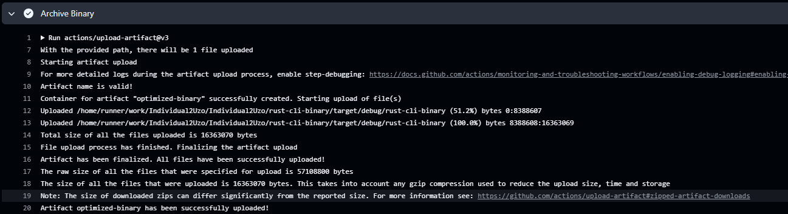

# Purpose
This purpose of this lab was to setup code that will take a csv file, create a SQL database, and utilize SQLite to perform CRUD (Create, Read, Update, Delete) Operations.  This library was utilized to make performing CRUD Operations with the database all through the command line, giving the project a CLI. Command line interfaces are important for the use of easy to use and integrate SQL into Rust and utilize it seamlessly. Rusqlite will be the library crate utilized for this process. 

Tasks Performed
Create SQL Database
Write code to utilize SQLite for query execution
Write up different CRUD SQL Queries to test functionality
Test connection

#### With the use of command line tools and SQLlite3 we were able to create a unisex name database compatible with SQL and with the use of the read_data CL tool we were able to create a query. Using C.R.U.D we can make changes to our Database if need be.

# IDS-706-Data-Engineering :computer:

## Individual Project 2 :page_facing_up:

## :ballot_box_with_check: Requirements
* __`Rust source code`__: The code should comprehensively understand Rust's syntax and unique features.
* __`Use of GitHub Copilot`__: In your README, explain how you utilized GitHub Copilot in your coding process.
* __`SQLite Database`__: Include a SQLite database and demonstrate CRUD (Create, Read, Update, Delete) operations.
* __`Optimized Rust Binary`__: Include a process that generates an optimized Rust binary as a GitHub Actions artifact that can be downloaded.
* __`README.md`__: A file that clearly explains what the project does, its dependencies, how to run the program, and how GitHub Copilot was used.
* __`GitHub Actions`__: A workflow file that tests, builds, and lints your Rust code.
* __`Video Demo`__: A YouTube link in README.md showing a clear, concise walkthrough and demonstration of your CLI binary.

## :ballot_box_with_check: To-do List
* __Rust Source Code__: Learn to structure Rust source code well and demonstrates a clear understanding of Rust's syntax and unique features.
* __SQLite Database__: Demonstrates CRUD operations on the SQLite database.
* __Use of GitHub Copilot__: Provide the code to install and run the program using GitHub Copilot.
* __Optimized Rust Binary__: Process included that generates an optimized Rust binary as a GitHub Actions artifact that can be downloaded.

## :ballot_box_with_check: Dataset
`unisex_names_tables.csv`
  - This dataset had a list of unisex names as well as the male and female share gaps along with a "gap" between the two.

## :ballot_box_with_check: Main Progress
#### `Section 1` Rust Source Code with SQLite Database
##### Create Rust source code to perform CRUD operations on an SQLite database.
* `lib.rs`
  - __extract__: Read the CSV file using the file's link.
  - __transform__: Convert the CSV data to a format suitable for the database.
  - __create__: Insert data into the database.
  - __read__:  Retrieve all entries from the database.
  - __update__: Modify existing entries in the database.
  - __delete__: Remove specific entries from the database.
* `main.rs`
  - Extract the CSV file, convert it to a database file, and then perform CRUD operations using it.
* `test.rs`
  - Test all the functions in 'lib.rs' and verify that the operations execute correctly.
 
#### `Section 2` Install Dependencies
##### Install the dependencies for Rust configuration.
* For the installation of dependencies required for Rust configuration, the dependencies used in the Rust files are listed in the Cargo.toml file, and 'cargo release'  or 'cargo build' is utilized for their installation.

#### `Section 3` Optimized Rust Binary
##### Rust binary that has been compiled in an optimized form.
* A process has been established using GitHub Actions to automate the building and storage of the Rust binary. With 'release' utilized for the build, the binary is then made available for download at the 'rust-cli-binary/target/release/rust-cli-binary' path.

#### `Section 4` GitHub Copilot
##### Use of GitHub Copilot
* How to utilize GitHub Copilot in coding process
  - Ask about the coding when writing the Rust CRUD file.
  - Inquire about why the code isn't running.
  - Seek assistance with setting up GitHub configuration.
#### `Section 5` GitHub Actions
##### Test, Build, and Lint Rust Code
* Using the __`cargo`__ command, the GitHub Actions file can test, build, and lint your Rust code effectively.
1. __`Test`__
  - Test the SQLite CRUD operation using Rust.
  - Use the `cargo test` for testing.

2. __`Build`__
  - Build the Rust code in the current directory.
  - `cargo build` compile the code and produce an executable binary or library.

3. __`Lint`__
  - Check Rust code for style guidelines, conventions, and potential errors or issues.
  - Use `cargo clippy --quiet`.
  - '--quiet' helps get only the resulting errors and warnings displayed without any additional output.

4. Archive Binary 

#### `Section 6` Result of Rust Performance
##### See the result of the rust code.
* When executing `cargo run`, the successful processing of the CRUD operations can be observed.

1. __`cargo run`__: This command triggers the extraction of a 'csv' file from its source link, followed by its transformation into a database file compatible with SQLite.

2. #### CRUD OPERATIONS
- After running `cargo run` we now can execute CRUD operations. 
- Create / Read : 
- Update / Read : 
- Delete / Read : 

## Use of Gen-AI 
- I utilized Generative AI to update my former code from python to rust and well as helping me solve errors in my github actions! Here is a sample of the work it helped me complete. 

- This made the process much faster and I also learned a lot along the way. Understanding how tools like `cargo release` optimize the build of Rust code was probably the biggest eye-opener for me. 

## :ballot_box_with_check: Demo Video
The entire process of configuring the Rust CLI Binary is explained in a demo video available at the following link : 

